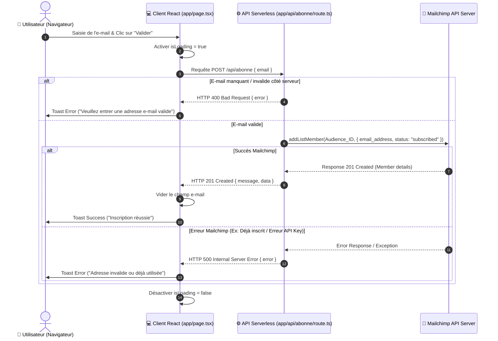

# 🚀 App-Takoudjou — Plateforme de Capture & Gestion d'Abonnés Mailchimp

[](https://nextjs.org/)
[](https://react.dev/)
[](https://www.typescriptlang.org/)
[](https://tailwindcss.com/)
[](https://mailchimp.com/)
[](#)

---

## 📋 Table des Matières

1. [Présentation du Projet](#-présentation-du-projet)
2. [Fonctionnalités Clés](#-fonctionnalités-clés)
3. [Architecture Technologique & Stack](#-architecture-technologique--stack)
4. [Schéma d'Architecture & Flux de Données](#-schéma-darchitecture--flux-de-données)
5. [Structure Complète du Projet](#-structure-complète-du-projet)
6. [Analyse Détaillée des Fichiers & Modules](#-analyse-détaillée-des-fichiers--modules)
   - [Application & Routing (`app/`)](#-application--routing-app)
   - [API Serverless (`app/api/`)](#-api-serverless-appapi)
   - [Composants UI (`app/LoaderTailwind.tsx`)](#-composants-ui-apploadertailwindtsx)
   - [Configurations Système & Build](#-configurations-système--build)
7. [Variables d'Environnement & Sécurité](#-variables-denvironnement--sécurité)
8. [Guide d'Installation & Démarrage rapide](#-guide-dinstallation--démarrage-rapide)
9. [Spécifications de l'API (`/api/abonne`)](#-spécifications-de-lapi-apiabonne)
10. [Design System & Métriques UI/UX](#-design-system--métriques-uiux)
11. [Guide de Maintenance & Évolutivité](#-guide-de-maintenance--évolutivité)
12. [Dépannage & FAQ](#-dépannage--faq)

---

## 🎯 Présentation du Projet

**App-Takoudjou** (identifié sous le nom de package `send_email`) est une application web moderne et performante construite sur l'architecture **Next.js 15 (App Router)** et **React 19**. 

Le projet a pour vocation principale de fournir une interface utilisateur haut de gamme, fluide et responsive dédiée à la **capture d'e-mails d'abonnés** et à leur **synchronisation directe en temps réel** avec les listes d'audience **Mailchimp** via des API Serverless sécurisées.

Le design intègre un thème sombre élégant (*Dark Theme*), des animations subtiles, des loaders d'états réactifs, des notifications toast contextuelles et une intégration sur mesure avec **Tailwind CSS v4** et **DaisyUI**.

---

## ✨ Fonctionnalités Clés

- ✉️ **Subscription Instantanée** : Inscription fluide des abonnés sans rechargement de page (*Single Page Experience*).
- 🐒 **Intégration Mailchimp Directe** : Connexion via l'API officielle Marketing v3 (`@mailchimp/mailchimp_marketing`).
- ⚡ **API Serverless Next.js** : Route API sécurisée `/api/abonne` isolant les clés secrètes du client browser.
- 🔔 **Retour Utilisateur en Temps Réel** : Notifications Toast avec `react-toastify` pour la confirmation ou la gestion fine des erreurs.
- ⏳ **Indicateurs de Chargement Dynamiques** : Double gestion de spinner (`ClipLoader` de `react-spinners` et le composant modulaire `LoaderTailwind`).
- 🎨 **Design Premium & Responsive** : UI épurée avec fond personnalisé (`bg-positive`), bordures dorées (`border-amber-500`), typographie Geist et DaisyUI themes.
- 🌐 **Configuration Réseau Déployable** : Serveur Next.js préconfiguré pour l'écoute sur le réseau local (`0.0.0.0:5173`).

---

## 🛠 Architecture Technologique & Stack

| Catégorie | Technologie | Version | Rôle & Description |
| :--- | :--- | :--- | :--- |
| **Framework Web** | [Next.js](https://nextjs.org/) | `15.5.3` | Framework React avec App Router & Turbopack |
| **Bibliothèque UI** | [React](https://react.dev/) | `19.1.0` | Bibliothèque de rendu d'interfaces déclaratives |
| **Langage** | [TypeScript](https://www.typescriptlang.org/) | `^5.0` | Typer le code JavaScript pour la sécurité au build |
| **Styling** | [Tailwind CSS](https://tailwindcss.com/) | `^4.0` | Framework CSS utilitaire dernière génération |
| **Composants UI** | [DaisyUI](https://daisyui.com/) | `^5.1.14` | Plugins de composants UI basés sur Tailwind |
| **Icônes** | [Lucide React](https://lucide.dev/) | `^0.544.0` | Collection d'icônes SVG haute performance |
| **Mailing Client** | [Mailchimp Marketing SDK](https://mailchimp.com/) | `^3.0.80` | SDK Node.js officiel pour l'API Mailchimp |
| **Notifications** | [React Toastify](https://fkhadra.github.io/react-toastify/) | `^11.0.5` | Composant de gestion de toasts / alertes UI |
| **Spinners / Loaders**| `react-spinners` & `react-loading` | `^0.17.0` | Animations UI de chargement |

---

## 📐 Schéma d'Architecture & Flux de Données

Voici le diagramme séquentiel décrivant le parcours utilisateur complet, de la saisie de l'e-mail jusqu'à la persistance dans les listes Mailchimp :



---

## 📁 Structure Complète du Projet

```text
App-Takoudjou/
├── app/                        # Dossier principal App Router (Next.js 15)
│   ├── api/                    # Routes API Serverless
│   │   └── abonne/
│   │       └── route.ts        # Handlers HTTP POST Mailchimp Integration
│   ├── LoaderTailwind.tsx      # Composant réutilisable de Spinner Tailwind/Accessibility
│   ├── globals.css             # Directives Tailwind v4 & classes utilitaires globales
│   ├── layout.tsx              # Root Layout HTML/Body, Fonts & Thème Dark
│   └── page.tsx                # Page d'accueil principale ("Bienvenue TAKOUDJOU")
├── public/                     # Images et ressources statiques
│   ├── ntr1.jpeg               # Image de fond de carte (bg-positive)
│   ├── ntr2.jpeg               # Asset graphique additionnel
│   ├── ntr3.jpeg               # Asset graphique additionnel
│   ├── ntr4.jpeg               # Asset graphique additionnel
│   ├── positive.jpeg           # Image thématique d'en-tête
│   └── priere.jpeg             # Asset graphique additionnel
├── .gitignore                  # Fichiers et dossiers ignorés par Git
├── eslint.config.mjs           # Configuration ESLint Flat Config (Next.js + TS)
├── next.config.ts              # Configuration Next.js (Binding réseau 0.0.0.0)
├── package.json                # Déclarations des dépendances et scripts npm
├── package-lock.json           # Arbre d'installation exact des dépendances
├── postcss.config.mjs          # Configuration PostCSS (@tailwindcss/postcss)
├── README.md                   # Documentation officielle du projet
├── tailwind.config.ts          # Configuration des thèmes DaisyUI et chemins d'analyse
└── tsconfig.json               # Configuration du compilateur TypeScript & Alias `@/*`
```

---

## 🔍 Analyse Détaillée des Fichiers & Modules

### 📱 Application & Routing (`app/`)

#### 1. [`app/layout.tsx`](file:///d:/Travaux_Moise/optimisation/App-Takoudjou/app/layout.tsx)
- **Role** : Conteneur racine global de l'application Next.js.
- **Fonctionnalités** :
  - Importation et optimisation des polices Google Fonts **Geist Sans** (`--font-geist-sans`) et **Geist Mono** (`--font-geist-mono`).
  - Définition des métadonnées système (`Metadata`).
  - Application de la classe HTML `data-theme="dark"` pour activer le mode sombre DaisyUI par défaut.
  - Injecte `globals.css` à l'ensemble du DOM.

#### 2. [`app/page.tsx`](file:///d:/Travaux_Moise/optimisation/App-Takoudjou/app/page.tsx)
- **Role** : Interface utilisateur principale de capture d'e-mail (`"use client"`).
- **États de Composants (`useState`)** :
  - `email` (`string`) : Stocke la valeur saisie dans l'input e-mail.
  - `isLoading` (`boolean`) : Gère l'affichage dynamique entre le formulaire et l'état de chargement (`ClipLoader`).
- **Gestionnaire d'événements `handleSubmit`** :
  - Empêche le rechargement standard du formulaire avec `e.preventDefault()`.
  - Exécute un `fetch('/api/abonne', { method: 'POST', body: JSON.stringify({ email }) })`.
  - En cas de réponse HTTP OK (`response.ok`), déclenche un toast de succès via `toast.success()` et réinitialise l'état `email`.
  - En cas d'erreur HTTP ou d'exception réseau, affiche un message d'erreur approprié via `toast.error()`.
- **Éléments d'Ergonomie UI** :
  - Bouton de réinitialisation rapide de la saisie (Icône `X` de `lucide-react`).
  - Bouton "Valider" interactif avec effet de survol dynamique (`hover:scale-110`).
  - Conteneur de Toasts configuré au centre supérieur (`position="top-center"`).

#### 3. [`app/globals.css`](file:///d:/Travaux_Moise/optimisation/App-Takoudjou/app/globals.css)
- **Role** : Style global de l'application sous Tailwind CSS v4.
- **Structure** :
  - Directives `@import "tailwindcss";`.
  - Classe utilitaire personnalisée dans `@layer utilities` :
    ```css
    .bg-positive {
      background-image: url('/ntr1.jpeg');
      background-size: cover;
      background-position: center;
    }
    ```

---

### ⚙️ API Serverless (`app/api/`)

#### 1. [`app/api/abonne/route.ts`](file:///d:/Travaux_Moise/optimisation/App-Takoudjou/app/api/abonne/route.ts)
- **Role** : Middleware serveur sécurisé exposant l'endpoint `POST` pour la souscription Mailchimp.
- **Architecture de Code** :
  ```typescript
  import mailChimp from "@mailchimp/mailchimp_marketing";
  import { NextResponse } from "next/server";

  mailChimp.setConfig({
    apiKey: process.env.MAILCHIMP_API_KEY!,
    server: process.env.MAILCHIMP_API_SERVER!,
  });
  ```
- **Flux d'Exécution** :
  1. Extrait `email` depuis la requête JSON entraante (`await request.json()`).
  2. Valide la présence du paramètre `email`. Si absent, renvoie un statut `HTTP 400` avec message explicatif.
  3. Appelle la méthode Mailchimp `mailChimp.lists.addListMember` avec l'Audience ID d'environnement (`process.env.MAILCHIMP_AUDIENCE_ID!`) et le statut `"subscribed"`.
  4. En cas de succès, renvoie `HTTP 201 Created`.
  5. En cas d'échec (ex: adresse e-mail invalide, membre déjà existant, clé API expirée), intercepte l'erreur dans un bloc `catch` et renvoie un statut `HTTP 500`.

---

### 🧩 Composants UI (`app/LoaderTailwind.tsx`)

#### 1. [`app/LoaderTailwind.tsx`](file:///d:/Travaux_Moise/optimisation/App-Takoudjou/app/LoaderTailwind.tsx)
- **Role** : Composant de spinner de chargement modulaire et accessible.
- **Props** :
  - `size` (`'sm' | 'md' | 'lg'`, par défaut `'md'`) : Contrôle les dimensions et l'épaisseur des bordures du spinner.
  - `overlay` (`boolean`, par défaut `false`) : Active un overlay blanc semi-transparent (`fixed inset-0 bg-white/70 z-50`) pour bloquer l'écran pendant un chargement global.
  - `text` (`string`, optionnel) : Libellé textuel affiché sous le spinner.
- **Accessibilité (A11y)** :
  - Intègre `role="status"`, `aria-live="polite"` et `aria-label` dynamique pour une compatibilité parfaite avec les lecteurs d'écran.

---

### 🛠 Configurations Système & Build

1. **[`next.config.ts`](file:///d:/Travaux_Moise/optimisation/App-Takoudjou/next.config.ts)** :
   - Définit les options de configuration de Next.js.
   - Configure le serveur pour écouter sur l'adresse réseau `0.0.0.0` et le port `5173`, permettant l'accès direct et le test depuis d'autres appareils du réseau local.
2. **[`tailwind.config.ts`](file:///d:/Travaux_Moise/optimisation/App-Takoudjou/tailwind.config.ts)** :
   - Spécifie les fichiers source à analyser dans `content`.
   - Charge le plugin **DaisyUI** (`plugins: [require("daisyui")]`).
   - Déclare une liste complète de thèmes DaisyUI supportés (`dark`, `light`, `cupcake`, `synthwave`, `luxury`, etc.).
3. **[`postcss.config.mjs`](file:///d:/Travaux_Moise/optimisation/App-Takoudjou/postcss.config.mjs)** :
   - Intègre le transformateur officiel `@tailwindcss/postcss`.
4. **[`tsconfig.json`](file:///d:/Travaux_Moise/optimisation/App-Takoudjou/tsconfig.json)** :
   - Active le mode strict TypeScript (`"strict": true`).
   - Configure l'alias de chemin racine `"@/*": ["./*"]`.

---

## 🔐 Variables d'Environnement & Sécurité

L'application requiert 3 variables d'environnement indispensables pour communiquer avec l'API Mailchimp.

Créez un fichier `.env.local` à la racine de votre projet avec le modèle suivant :

```env
# ==========================================
# CONFIGURATION MAILCHIMP MARKETING API
# ==========================================

# Clé d'API Mailchimp générée sur votre compte (ex: 123456789abcdef-us21)
MAILCHIMP_API_KEY=votre_cle_api_mailchimp

# Serveur / Data Center Mailchimp (correspond au suffixe de votre clé API, ex: us21, us6, etc.)
MAILCHIMP_API_SERVER=us21

# Identifiant unique de l'Audience / Liste d'abonnés cible
MAILCHIMP_AUDIENCE_ID=votre_audience_id
```

> [!IMPORTANT]
> Ne commitez **jamais** le fichier `.env.local` dans votre gestionnaire de version Git. Le fichier `.gitignore` du projet est déjà configuré pour ignorer ce fichier de clés d'accès.

---

## 🚀 Guide d'Installation & Démarrage rapide

### Prérequis

- **Node.js** : Version `18.17.0` ou supérieure (Recommandé : `v20.x`).
- **Gestionnaire de paquets** : `npm`, `pnpm`, ou `yarn`.

### Étapes d'Installation

1. **Cloner le projet ou se placer dans le répertoire** :
   ```bash
   cd App-Takoudjou
   ```

2. **Installer les dépendances** :
   ```bash
   npm install
   ```

3. **Configurer les variables d'environnement** :
   Créez le fichier `.env.local` et renseignez les valeurs Mailchimp comme décrit dans la section précédente.

4. **Lancer le serveur de développement avec Turbopack** :
   ```bash
   npm run dev
   ```

5. **Accéder à l'application** :
   - Localement : `http://localhost:5173` ou `http://localhost:3000`
   - Sur votre réseau local : `http://<VOTRE_IP_LOCALE>:5173`

---

## 📡 Spécifications de l'API (`/api/abonne`)

### Endpoint

`POST /api/abonne`

### En-têtes HTTP requis

```http
Content-Type: application/json
```

### Corps de la Requête (JSON Body)

```json
{
  "email": "utilisateur@example.com"
}
```

### Réponses HTTP

#### 1. Succès — `201 Created`

```json
{
  "message": "L'adresse e-mail iscripten avec success✅",
  "data": {
    "id": "e4d3c2b1a0...",
    "email_address": "utilisateur@example.com",
    "unique_email_id": "a1b2c3d4e5",
    "status": "subscribed"
  }
}
```

#### 2. Erreur Client (Champ vide) — `400 Bad Request`

```json
{
  "error": "Veuillez enter une adresse e-mail valide "
}
```

#### 3. Erreur Serveur / Mailchimp — `500 Internal Server Error`

```json
{
  "error": "Cette adresse e-mail n'est pas valide ou est deja utilisee 🚫"
}
```

---

## 🎨 Design System & Métriques UI/UX

L'interface de l'application repose sur un design moderne, contrasté et immersif :

- **Couleurs Principales** :
  - Fond de page : Slate 900 (`bg-slate-900` `#0f172a`).
  - Carte de formulaire : Dark / Slate 950 avec bordure ambrée (`border-amber-500` `#f59e0b`).
  - Bouton d'action : Amber 300 (`bg-amber-300` `#fcd34d`).
  - Champ de saisie : Slate 50 (`bg-slate-50`).
- **Typographie** : Font Geist Sans native Next.js.
- **Micro-interactions** :
  - Effet de grossissement du bouton au survol : `hover:scale-110` (`transition-transform duration-300`).
  - Ombre portée accentuée sur la carte d'inscription : `shadow-2xl`.

---

## 🛠 Guide de Maintenance & Évolutivité

Pour maintenir le projet propre, robuste et facilement évolutif dans le temps, suivez les recommandations suivantes :

### 1. Ajout de Nouveaux Champs de Formulaire (ex: Nom, Prénom)
- **Côté Client (`app/page.tsx`)** :
  - Ajouter les états `firstName` et `lastName` via `useState`.
  - Mettre à jour l'objet envoyé dans le corps du `fetch` : `JSON.stringify({ email, firstName, lastName })`.
- **Côté API (`app/api/abonne/route.ts`)** :
  - Extraire `firstName` et `lastName` depuis `await request.json()`.
  - Passer le paramètre `merge_fields` dans l'appel `addListMember` :
    ```typescript
    await mailChimp.lists.addListMember(process.env.MAILCHIMP_AUDIENCE_ID!, {
      email_address: email,
      status: "subscribed",
      merge_fields: {
        FNAME: firstName,
        LNAME: lastName,
      }
    });
    ```

### 2. Migration ou Ajout de Services de Mailing (ex: SendGrid, Resend)
Grâce à l'isolation de la logique dans la route API `app/api/abonne/route.ts`, vous pouvez changer de fournisseur d'e-mail ou ajouter un double envoi (Mailchimp + Resend) sans modifier une seule ligne du composant UI client.

### 3. Contrôle de Qualité et Linting
Exécutez régulièrement la commande suivante pour valider le typage et le respect des normes ESLint :
```bash
npm run lint
```

---

## ❓ Dépannage & FAQ

#### Q1 : L'API retourne une erreur 500 lors de l'inscription
👉 **Vérifications** :
1. Assurez-vous que votre fichier `.env.local` est bien créé à la racine et contient des identifiants valides.
2. Vérifiez que `MAILCHIMP_API_SERVER` correspond exactement au suffixe de votre clé API (ex: si votre clé finit par `-us21`, le serveur doit être `us21`).
3. L'adresse e-mail testée est-elle déjà inscrite dans votre audience Mailchimp ? Mailchimp rejette les doublons en souscription simple.

#### Q2 : Le serveur ne répond pas sur mon téléphone en réseau local
👉 **Solution** : Vérifiez que le port `5173` ou `3000` est ouvert sur le pare-feu de votre ordinateur et que votre appareil est connecté au même réseau Wi-Fi.

---

<div align="center">

</div>
